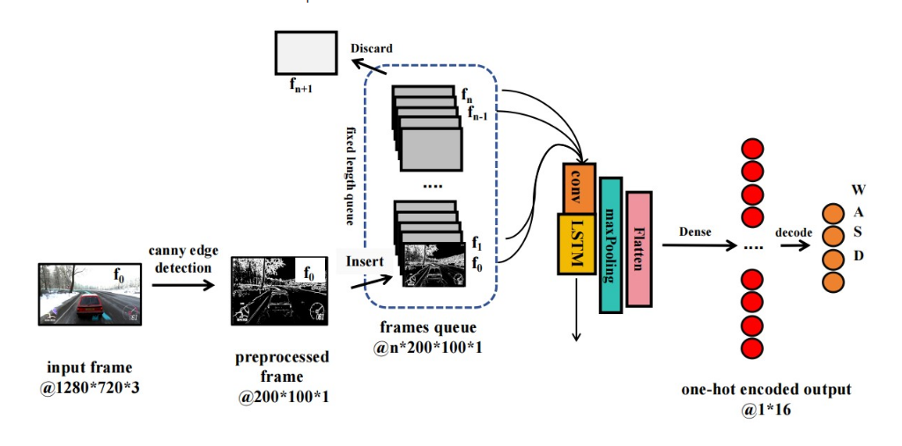
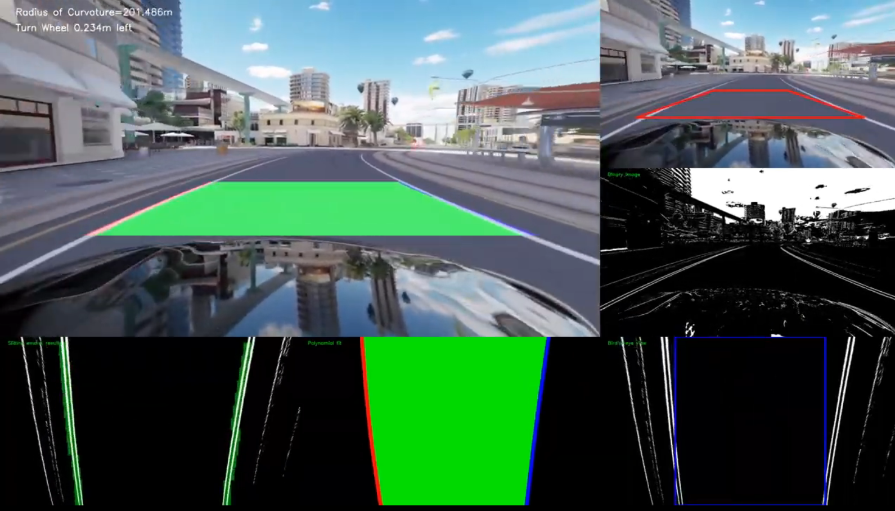
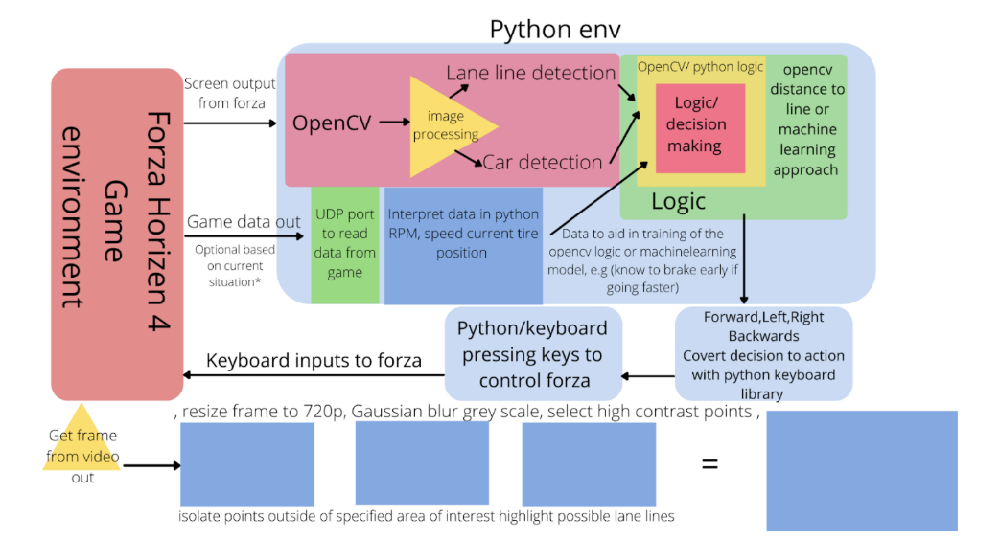
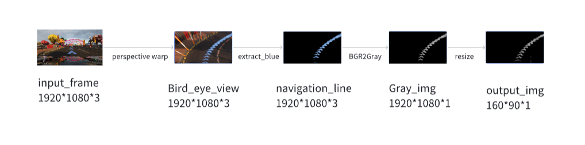
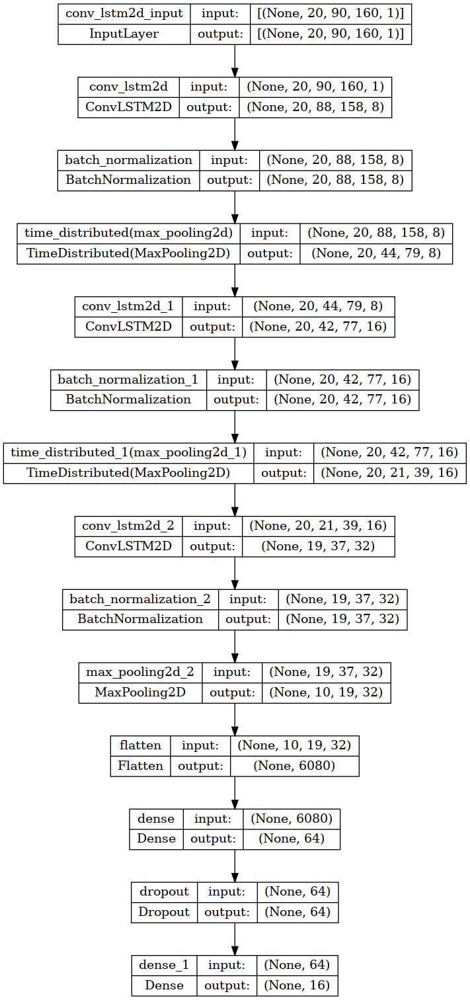

这个项目的目标是创建一个神经网络模型能够控制游戏中的车按照路上的导航线正确地行驶。

## How

1.收集玩家的数据集：包括游戏中的屏幕画面和键盘输入事件；

2.数据预处理：通过opencv对屏幕图像数据进行，裁剪，颜色提取，灰度处理，图像透视变换；

3.神经网络训练：将预处理的图像作为训练输入，对应的键盘事件作为训练输出，在神经网络中进行训练；

4.在游戏环境中进行模型预测：将屏幕上的图像信息输入模型，得到模型预测的输出，并实时将预测的输出键盘事件运用于游戏中。

## Reference

- ##### 基于神经网络的车辆控制：[EthanNCai/AI-Plays-ForzaHorizon4](https://github.com/EthanNCai/AI-Plays-ForzaHorizon4)

  *受车道线清晰度的影响很大，有的道路没有车道线或只有一边有车道线，亦或是车道线断断续续；并且由于使用的是opencv的canny边缘检测，图像中会有很多无关紧要的数据，最终训练出来的模型很难收敛。(可能是因为我收集的数据集太少）*

- ##### 使用slidiing window approach方法，基于opencv的车道线识别：[uppala75/CarND-Advanced-Lane-Lines](https://github.com/uppala75/CarND-Advanced-Lane-Lines?tab=readme-ov-file)

  *借鉴了其中的透视转换生成车辆前方鸟瞰图。在正面视图中，线路越远像素越小，这意味着如果像素越来越小，就越来越难以检测和锁定未来的线线路。采用鸟瞰视图可以更清楚地看到远处地线路，为将来到转弯做好充分的准备。*

- ##### 结合上面车道线识别和yolo实现识别车道线，行人，车辆，交通灯：[jimhoggey/SelfdrivingcarForza](https://github.com/jimhoggey/SelfdrivingcarForza)

  *好像只给出了一个构想，目前好像并没有完全实现*

## Getting Started

#### Step1: 收集数据集

运行`DataColleciton.py`收集屏幕的数据和键盘的输入。在这个步骤中我们对提前用*opencv*对图像进行了处理，确保收集到的数据文件不会过大。处理后的数据集以*ndarray*的形式保存在*npy*文件中。

#### Step2: 数据预处理

运行`ConvLSTM-DataPreprocess.py`进行数据预处理

1. **转化为序列数据**：

将输入数据和输出标签转换为序列数据，以适应 LSTM 模型的输入要求。对于每一个输入序列，提取过去 *pass_frame*帧的数据作为输入，并将对应的输出标签作为目标。

2. **平衡数据**：
   - 统计每个标签的数量。
   - 计算每个标签的平均数量，作为平衡目标。
   - 对于数量少于平衡目标的标签，保留所有数据；对于数量多于平衡目标的标签，随机抽样以达到平衡目标。
   - 将平衡后的数据打乱顺序。

3. **对标签进行独热编码**：

​    *onehot_encode*函数对键盘的事件进行独热编码。

进行以上处理后，同样将数据以*ndarray*的形式存在*npy*文件中。

#### Step3: 模型训练

运行`ConvLSTM-TrainModel.py`读取经过经过预处理的数据，输入模型进行训练。

在本项目中使用的网络层主要有：

1. **ConvLSTM2D 层**：用于处理时空数据，捕捉时间和空间上的相关性。

2. **BatchNormalization 层**：对每一层的输入进行标准化，以加速训练并提高模型的稳定性。

3. **TimeDistributed 层**：将 MaxPooling2D 层应用于输入序列的每一个时间步。

4. **MaxPooling2D 层**：对输入的空间维度进行下采样，以减少计算量和内存使用。

5. **Flatten 层**：将多维输入展平为一维，以便输入到全连接层。

6. **Dense 层**：对输入进行线性变换，并应用激活函数。

7. **Dropout 层**：在训练过程中随机丢弃一部分输入单元，以防止过拟合。

   

#### Step4: 模型预测

在打开游戏环境的情况下，运行`ConvLSTM-PlayModel.py`，读取屏幕中的数据并进行处理，作为模型的输入，通过*pyautogui*响应模型输出的按键数据，达到控制车辆按着导航线运动的效果。

